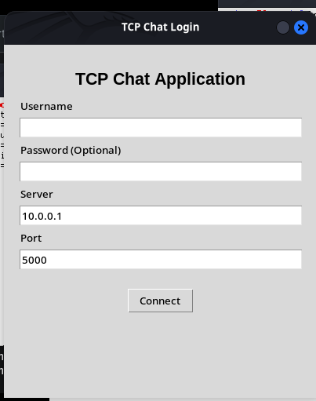
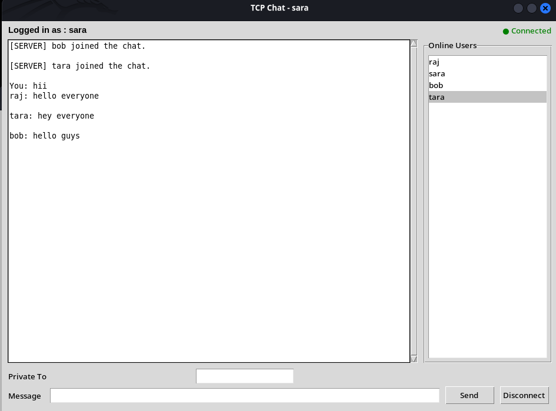
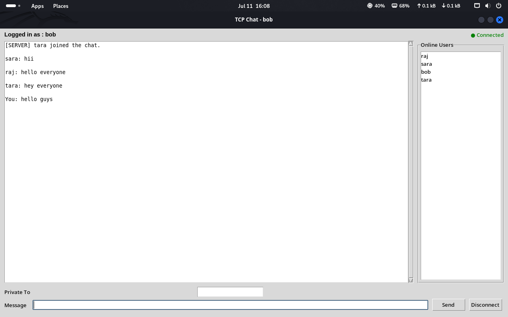
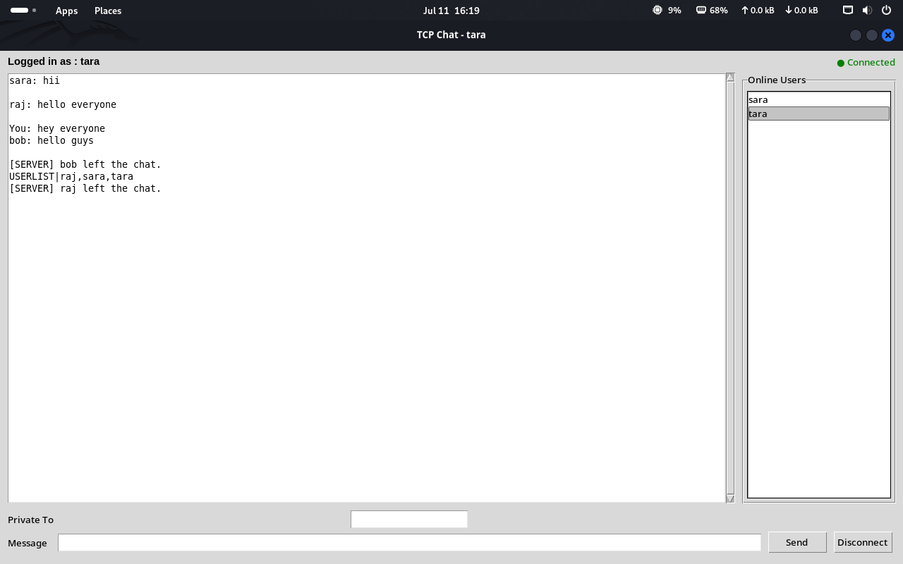
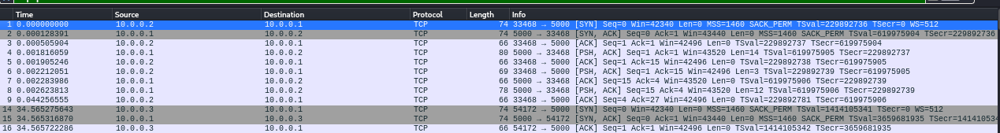
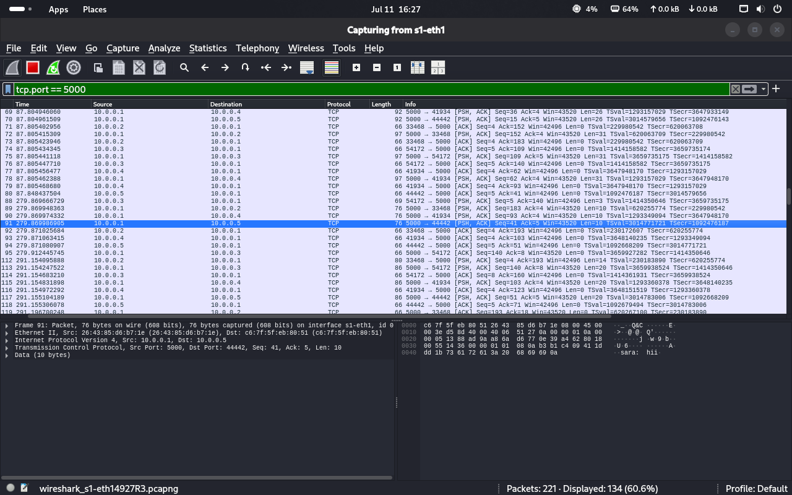
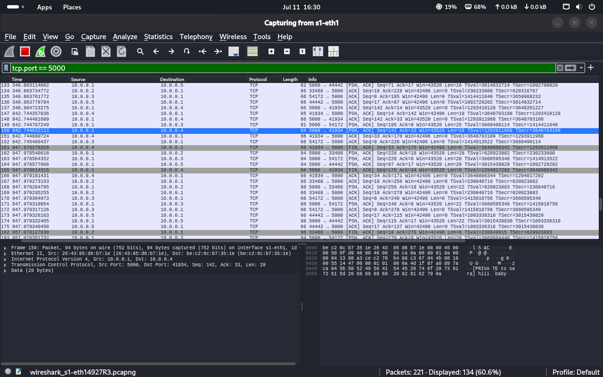
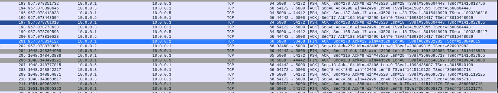

# GUI-Based Multi-Client Chat Application Using TCP

## Project Title
GUI-Based Multi-Client Chat Application Using TCP

## Objective
The objective of this project is to convert the terminal-based TCP chat application from Assignment 5 into a graphical desktop application using Python Tkinter. The server logic is reused with minimal modification, while the client is redesigned with a login window, chat window, online user list, and responsive background message handling.

## Software Requirements
- Python 3
- Tkinter (`python3-tk`)
- Mininet
- Wireshark
- Linux environment such as Ubuntu, Kali, or Parrot OS

## Network Topology
The assignment uses one server and four clients in Mininet.

```text
sudo /usr/bin/local/mn --topo single,5
```

Topology:
- `h1` : Chat Server
- `h2` : Client A
- `h3` : Client B
- `h4` : Client C
- `h5` : Client D

Verify connectivity using:
```bash
nodes
net
pingall
```

## Execution Steps
1. Start Mininet:
   ```bash
   sudo /usr/bin/local/mn --topo single,5
   ```

2. Start the server on `h1`:
   ```bash
   h1 python3 server.py
   ```

3. Open separate terminals for clients:
   ```bash
   xterm h2
   xterm h3
   xterm h4
   xterm h5
   ```

4. Run the GUI client on each host:
   ```bash
   python3 client_gui.py
   ```

5. Use the server IP:
   ```text
   10.0.0.1
   ```

6. Login with a unique username for each client and test broadcast, private messaging, user list updates, and disconnect.

## Brief Description of the Implementation
This application is based on a client-server TCP architecture.

### Server Side
The server accepts multiple clients using threads and supports:
- username login
- broadcast messaging
- private messaging using `/msg <username> <message>`
- online user list using `/list`
- join and leave notifications
- chat history logging
- performance logging

### Client Side
The GUI client is implemented in Tkinter and includes:
- login window
- message display area with scrolling
- message input box
- recipient selection for broadcast or private message
- online users list
- connect and disconnect controls
- background thread for receiving messages so the GUI remains responsive

## Sample Screenshots
The following screenshots demonstrate the main features of the application.

### 1. Login Window


### 2. Chat Window After Successful Connection


### 3. Broadcast Messaging


### 4. Private Messaging
.png)

### 5. Client Disconnect


### 6. Wireshark Capture: Connection


### 7. Wireshark Capture: Broadcast


### 8. Wireshark Capture: Private Message


### 9. Wireshark Capture: Disconnect


## Features Tested
- User login
- Broadcast messaging
- Private messaging
- Online user list
- Join notification
- Leave notification
- Disconnect
- Multiple simultaneous clients

## Notes
- This project reuses the Assignment 5 networking logic.
- The GUI client keeps socket receiving operations in a separate background thread.
- The recommended Wireshark filter is:
  ```text
  tcp.port == 5000
  ```

## Repository Structure
```text
ISEA-Phase3-TezpurUniversity-Assignment6/
│── server.py
│── client_gui.py
│── screenshots/
│   ├── Login.png
│   ├── Broadcast.png
│   ├── Private_Message.png
│   ├── Online_Users.png
│   ├── Disconnect.png
│   ├── Wireshark_Connection.png
│   ├── Wireshark_Broadcast.png
│   ├── Wireshark_PrivateMessage.png
│   └── Wireshark_Disconnect.png
│── report.pdf
└── README.md
```


