# 🔒 Secure TCP Chat Application
### Assignment 7 – Secure Network Application Development Using TCP


## 👨‍💻 Student Information

**Name:** Parth Rawat  
**Roll Number:** 0126CY231042

---

# 📖 Project Overview

This project is an enhanced version of the multi-client TCP Chat Application developed in Assignment 6. The application has been upgraded by implementing practical security mechanisms such as user authentication, secure password storage, duplicate login prevention, input validation, failed login protection, session timeout, secure logging, and Wireshark verification.

---

# 🎯 Objectives

- Develop a secure multi-client TCP chat application.
- Implement authentication using username and password.
- Store passwords securely using SHA-256 hashing.
- Prevent duplicate logins.
- Validate user input.
- Protect against brute-force login attempts.
- Implement session timeout and secure logging.
- Verify communication using Wireshark.

---

# 🛠 Technologies Used

- Python 3
- Socket Programming
- Tkinter GUI
- Threading
- SHA-256 (hashlib)
- JSON / CSV
- Mininet
- Wireshark
- Linux (Ubuntu)

---

# ✨ Security Features

- ✅ User Authentication
- ✅ SHA-256 Password Hashing
- ✅ Duplicate Login Prevention
- ✅ Input Validation
- ✅ Failed Login Protection
- ✅ Session Timeout
- ✅ Logout Support
- ✅ Secure Logging
- ✅ Wireshark Verification

---

# 📂 Project Structure

```text
Assignment-7/
├── server.py
├── client_gui.py
├── users.json
├── security_log.txt
├── screenshots/
├── report.pdf
├── README.md
└── handwritten_reflection.pdf
```

---

# 🚀 How to Run

```bash
sudo mn --topo single,5
python3 server.py
python3 client_gui.py
```

---

# 📸 Screenshots

Place the following screenshots inside the `Screenshots` folder:

# 📸 Screenshots

## 1. Login Window Before Connect
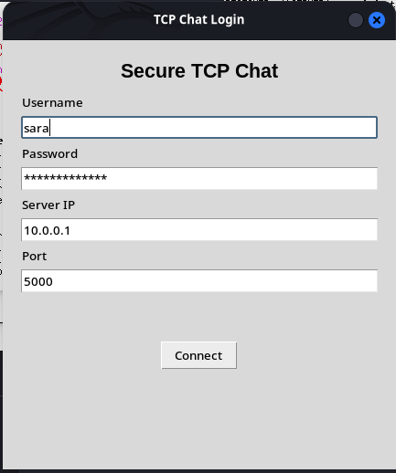

## 2. Successful Login with Online Users
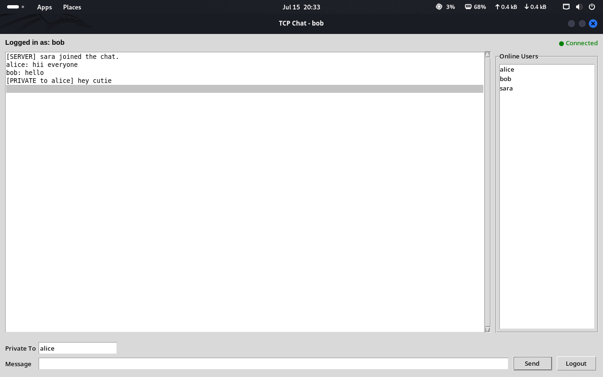

## 3. Duplicate Login Prevention
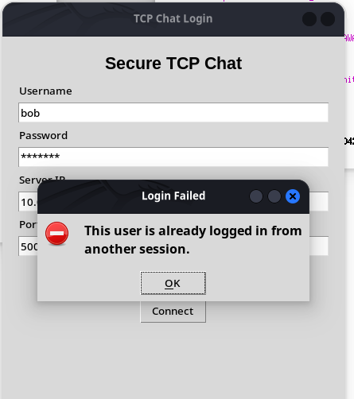

## 4. Invalid Username Login
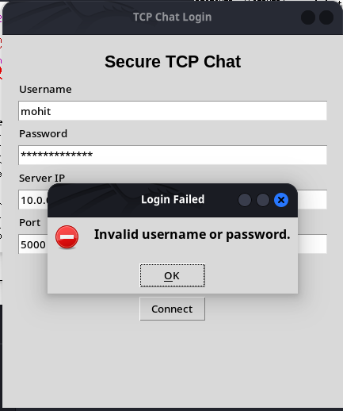

## 5. Invalid Username or Password Login
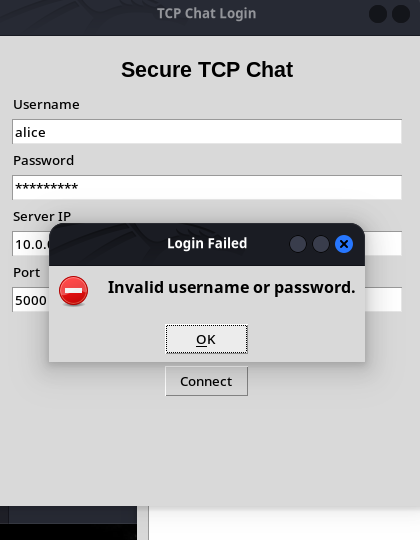

## 6. Login Lockout After Failed Attempts
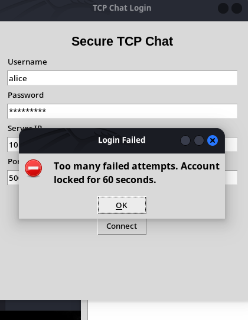

## 7. Unsupported Command Error
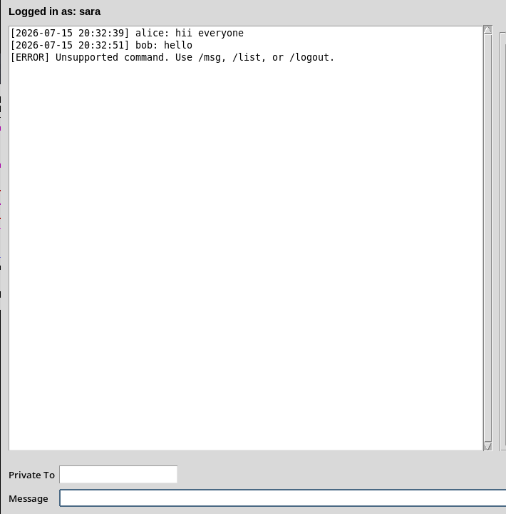

## 8. Authenticated Chat History
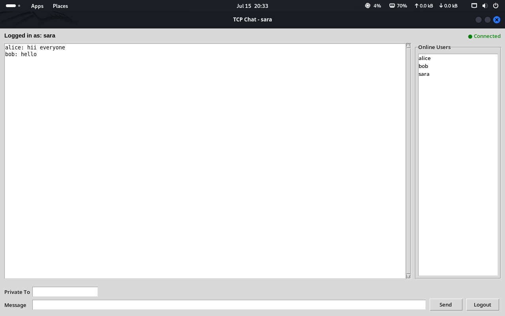

## 9. Session Timeout


## 10. Wireshark Login Capture
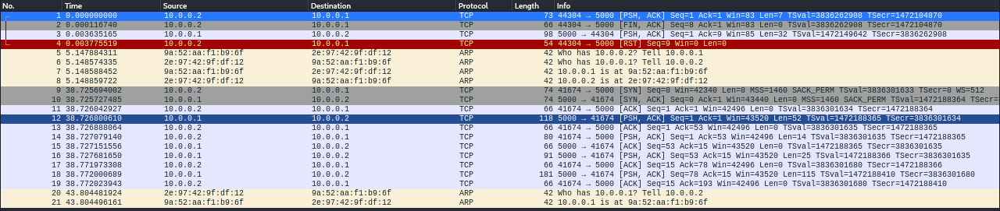

## 11. Wireshark Failed Login
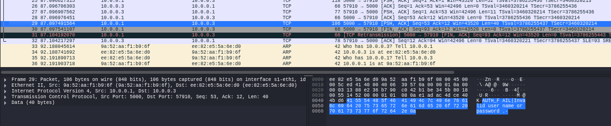

## 12. Wireshark Broadcast Message
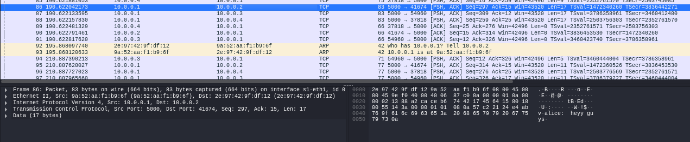

## 13. Wireshark Logout
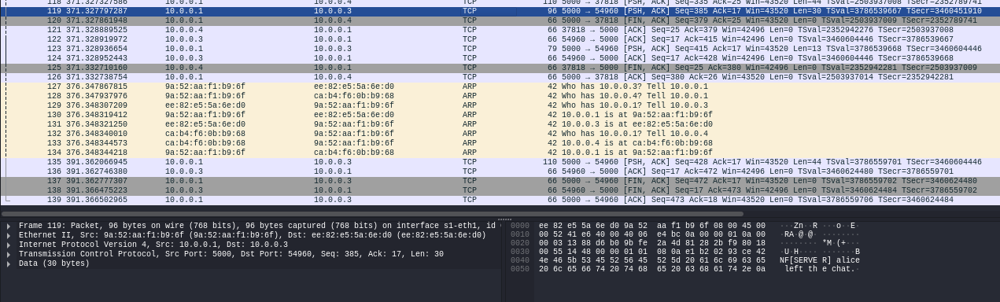

## 14. Mininet Network Setup
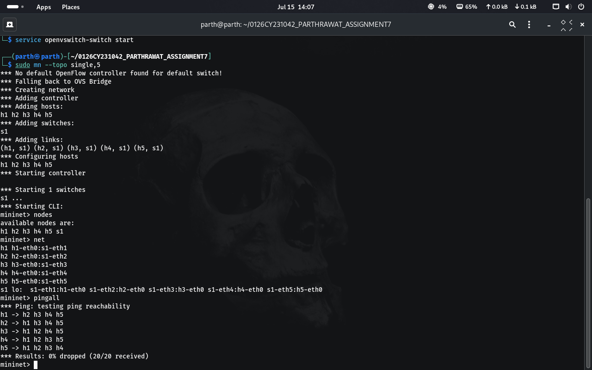
---

# 📡 Wireshark Filter

```text
tcp.port == 5000
```

---

# 🧪 Testing Summary

| Test Case | Status |
|-----------|--------|
| Successful Login | ✅ |
| Invalid Username | ✅ |
| Wrong Password | ✅ |
| Duplicate Login | ✅ |
| Failed Login Lock | ✅ |
| Public Chat | ✅ |
| Private Chat | ✅ |
| Session Timeout | ✅ |
| Logout | ✅ |
| Wireshark Verification | ✅ |

---

# 📚 Learning Outcomes

- Authentication
- Password Hashing
- Secure TCP Communication
- Input Validation
- Session Management
- Secure Logging
- Wireshark Packet Analysis

---

# ✅ Conclusion

The application successfully integrates authentication, SHA-256 password hashing, duplicate login prevention, session timeout, input validation, secure logging, and Wireshark verification to provide a secure TCP chat system.

---

⭐ Developed for Assignment 7.
