# 🚀 TCP Chat Application -- Assignment 8

### Application Optimization, Scalability and Reliability


------------------------------------------------------------------------

## 👨‍💻 Student Information

  ---------------- -------------------
  **Name**         Parth Rawat
  **Roll No.**     0126CY231042
  ---------------- -------------------

------------------------------------------------------------------------

## 📖 Project Overview

This project is the enhanced version of the Secure TCP Chat Application
developed in Assignment 7. The focus of Assignment 8 is to improve
**connection management, reliability, scalability, configuration
management, and performance evaluation** while preserving the existing
TCP communication protocol.

------------------------------------------------------------------------

## 🎯 Assignment Objectives

-   Improve connection management
-   Automatic inactive client cleanup
-   Graceful shutdown
-   Automatic reconnection support
-   Support 10 concurrent clients
-   Configuration management using `config.json`
-   Automatic performance logging
-   Wireshark verification
-   Performance evaluation using graphs

------------------------------------------------------------------------

## ✨ Features

### 🔹 Connection Management

-   Automatic client cleanup
-   Duplicate login prevention
-   Session timeout
-   Online users management

### 🔹 Reliability

-   Graceful shutdown
-   Exception handling
-   Login validation
-   Account lockout protection

### 🔹 Scalability

-   Supports **10 concurrent clients**
-   Thread-safe client handling
-   Optimized socket management

### 🔹 Performance

-   Auto-generated `performance_results.csv`
-   Delay measurement
-   Throughput calculation
-   CPU usage logging
-   Memory usage logging
-   Graph generation

------------------------------------------------------------------------

## 🛠 Technologies Used

-   Python 3
-   Socket Programming
-   Tkinter
-   Threading
-   JSON
-   CSV
-   SHA-256
-   psutil
-   Wireshark
-   Mininet

------------------------------------------------------------------------

## 📂 Project Structure

``` text
Assignment-8/
│
├── server.py
├── client_gui.py
├── config.json
├── users.json
├── performance_results.csv
├── chat_history.csv
├── security_log.txt
├── graphs/
├── screenshots/
├── report.pdf
├── handwritten_reflection.pdf
└── README.md
```

------------------------------------------------------------------------

## 🚀 Getting Started

### Clone Repository

``` bash
git clone <repository-url>
cd Assignment-8
```

### Run Server

``` bash
python3 server.py
```

### Run Client

``` bash
python3 client_gui.py
```

------------------------------------------------------------------------

## 📊 Performance Evaluation

   Concurrent Clients   Status
  -------------------- --------
           5              ✅
           8              ✅
           10             ✅

### Metrics Collected

-   Average Delay
-   Throughput
-   CPU Usage
-   Memory Usage

## 📊 Performance Graphs

### Average Delay vs Concurrent Clients
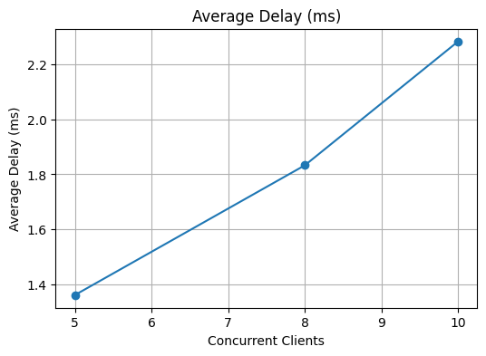

### Throughput vs Concurrent Clients
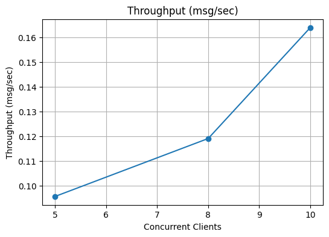

### CPU Usage vs Concurrent Clients
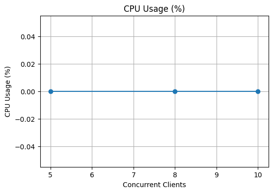

### Memory Usage vs Concurrent Clients
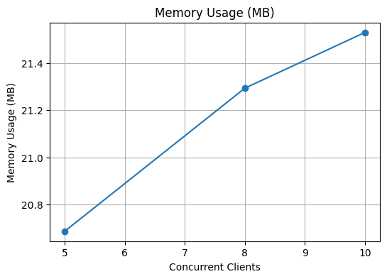
------------------------------------------------------------------------

## 📸 Screenshots

### Successful Login
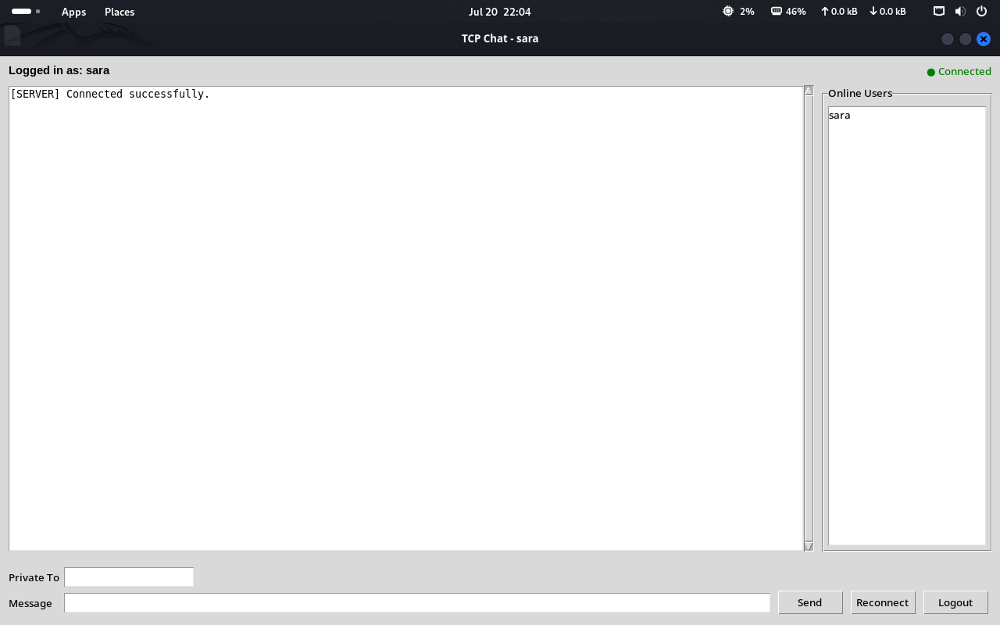

### Authenticated Chat
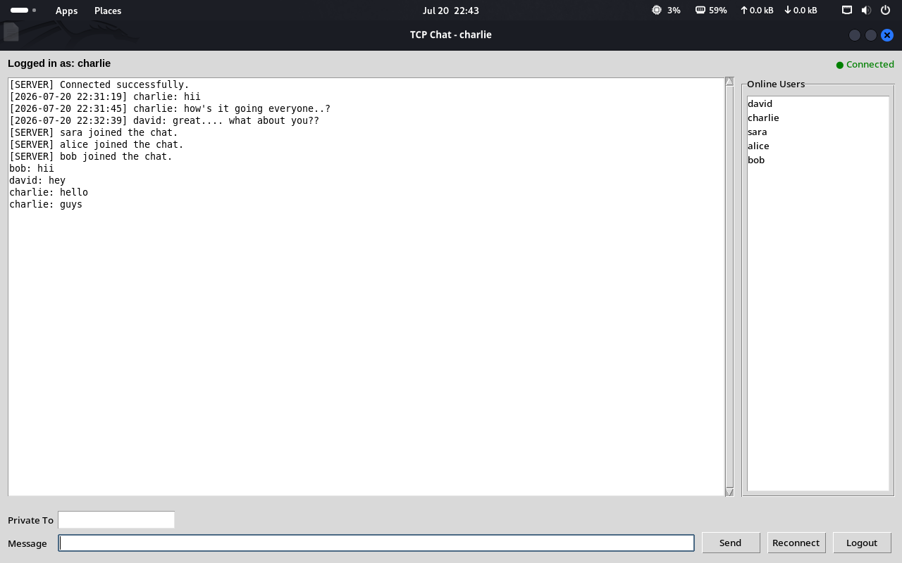

### Duplicate Login Blocked
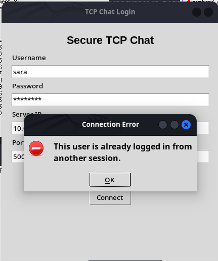

### Wrong Password
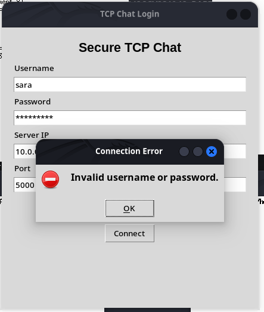

### Password Too Short
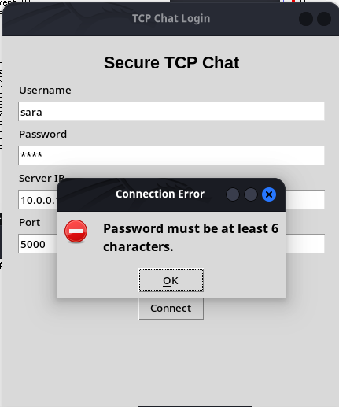

### Account Lockout
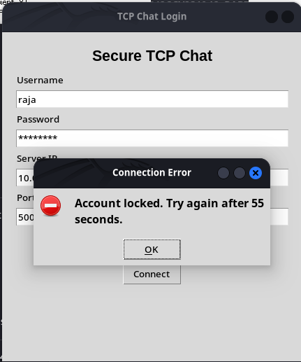

### Session Timeout
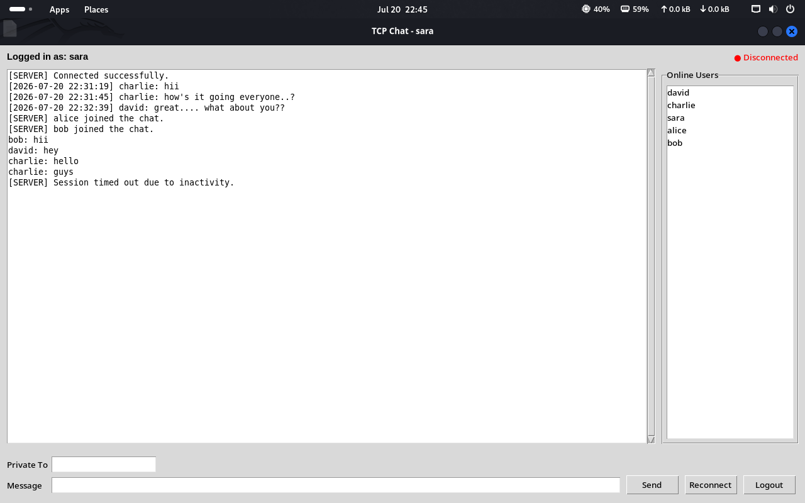

### Logout
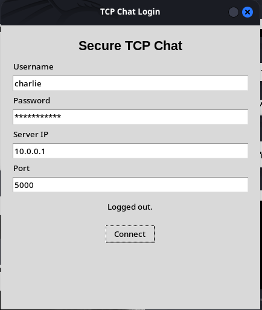

### Wireshark Login Success
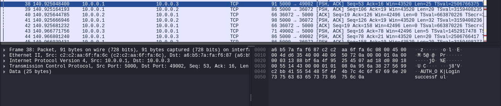

### Wireshark Authenticated Chat
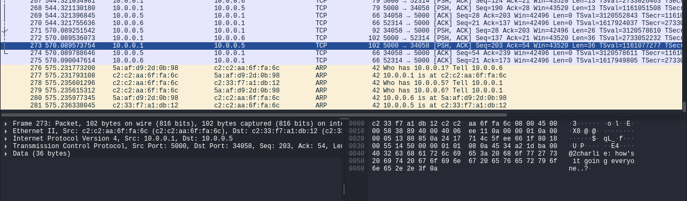

### Wireshark Failed Login
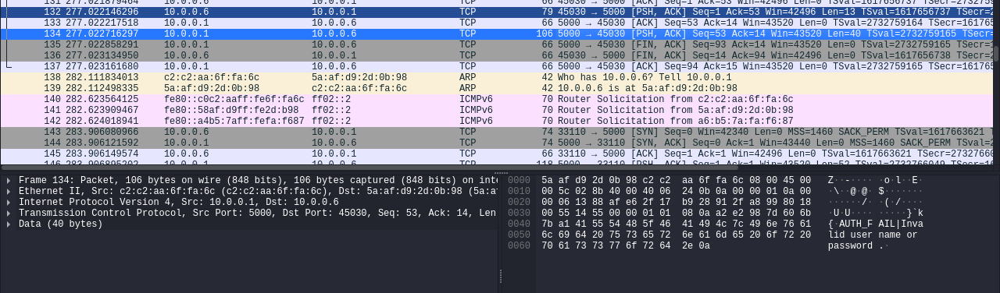

### Wireshark Logout
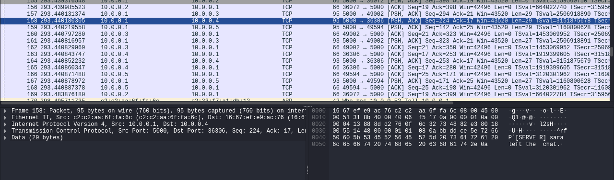

------------------------------------------------------------------------

## 📡 Wireshark Filter

``` text
tcp.port == 5000
```

------------------------------------------------------------------------

## ✅ Testing Summary

  Test Case                   Status
  -------------------------- --------
  Login Authentication          ✅
  Duplicate Login               ✅
  Session Timeout               ✅
  Private Chat                  ✅
  Broadcast Chat                ✅
  Auto Performance Logging      ✅
  10 Concurrent Clients         ✅
  Wireshark Verification        ✅

------------------------------------------------------------------------

## 📚 Learning Outcomes

-   Connection Management
-   Reliability Enhancement
-   Scalability Improvement
-   Configuration Management
-   Performance Evaluation
-   TCP Socket Programming
-   Wireshark Packet Analysis

------------------------------------------------------------------------

## ✅ Conclusion

This project successfully enhances the previous TCP-based multi-client
chat application by improving connection management, reliability,
scalability, and performance monitoring. It supports up to 10 concurrent
clients, uses configurable settings through `config.json`, automatically
generates performance logs, and verifies TCP communication using
Wireshark. The implementation demonstrates a stable, maintainable, and
optimized client-server application suitable for the Assignment 8
objectives.

------------------------------------------------------------------------

⭐ **Developed by Parth Rawat**
